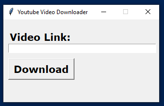

# youtube-download
Basic YouTube video downloader python script

It downloads the video into Desktop directory in Windows

# How to install dependencies
```
pip install -r requirements.txt
```

# How to run
```
python youtube.py
```

# Screen Shot

